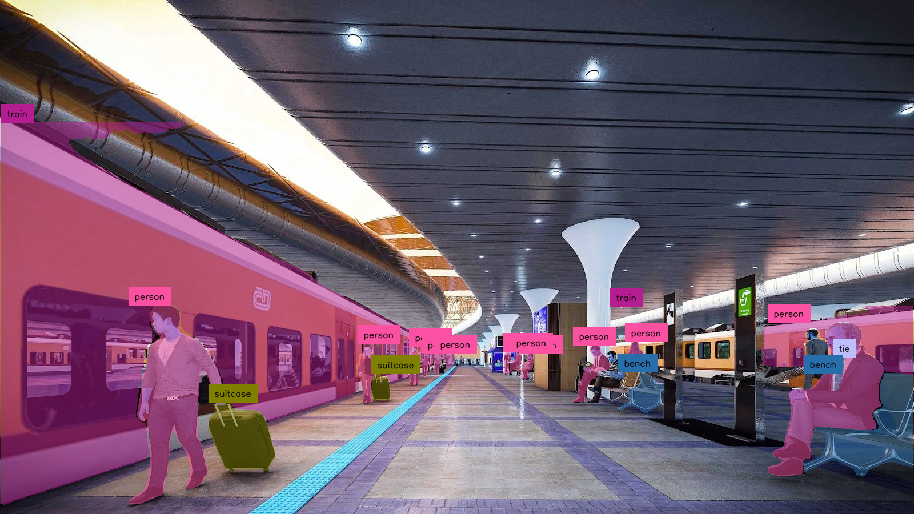

# AI-Enhanced Product Photoshoot Visuals and Filter

## Overview

https://github.com/MihirRajeshPanchal/zocket-hackathon/assets/78205431/121368b4-3b85-4af8-883e-66f502a8923a

In the dynamic landscape of e-commerce, the visual representation of products plays a pivotal role in capturing customer attention and driving sales. This project aims to address this challenge by developing an innovative AI solution that combines generative capabilities for product photoshoot visuals and an intelligent filter for product recognition. The solution targets a predefined list of products, including shoes, apparel, electronics, and accessories.

## Key Objectives

### 1. Generative AI for Visuals:

- **Objective:** Implement a generative AI model capable of creating realistic and visually appealing product photoshoot visuals.
  
- **Details:** The model should possess the ability to comprehend and simulate diverse lighting conditions, backgrounds, and angles commonly employed in product photography.

### 2. Product Recognition Filter:

- **Objective:** Develop an AI filter capable of identifying and isolating specific products within a given image dataset.

- **Details:** The filter should be trained to recognize a predefined set of products, enhancing their features while preserving the overall image integrity.

### 3. Exclusion of Non-Relevant Images:

- **Objective:** Implement a mechanism to filter out images devoid of any specified products to ensure the processing of only relevant visuals.

- **Details:** This step is crucial for optimizing computational resources and focusing on images that contribute to the enhancement of product visuals.

## Evaluation Criteria

Participants will be assessed based on the following criteria:

1. **Visual Appeal:** The generated product visuals should exhibit aesthetic appeal, realism, and creativity.
   
2. **Product Recognition Accuracy:** The filter must accurately identify and enhance the specified products within the images, demonstrating a high level of precision.

3. **Exclusion of Non-Relevant Images:** The solution should effectively filter out images that do not contain the target products, contributing to the efficiency of the overall process.

4. **Innovation and Creativity:** Bonus points will be awarded for innovative approaches and creative enhancements applied to the product visuals, showcasing a unique and inventive solution.

## Implementation Guidelines

- Participants are encouraged to leverage pre-existing generative models or develop custom models tailored to the specific requirements of the problem.
  
- Ethical considerations must be prioritized, ensuring that the solution respects privacy and intellectual property rights.

## Getting Started

To kickstart your project, follow these steps:

1. Clone the repository to your local machine.
2. Install the necessary dependencies specified in the requirements.txt file.
3. Refer to the documentation for detailed instructions on training the generative model and implementing the product recognition filter.
4. Ensure compliance with ethical considerations and adhere to best practices in the field of AI.

## Contribution Guidelines

We welcome contributions and enhancements to this project. Please follow the guidelines outlined in the CONTRIBUTING.md file for a smooth collaboration process.

## License

This project is licensed under the [MIT License](LICENSE), granting participants the freedom to use, modify, and distribute the code within the specified terms.
